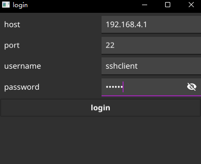
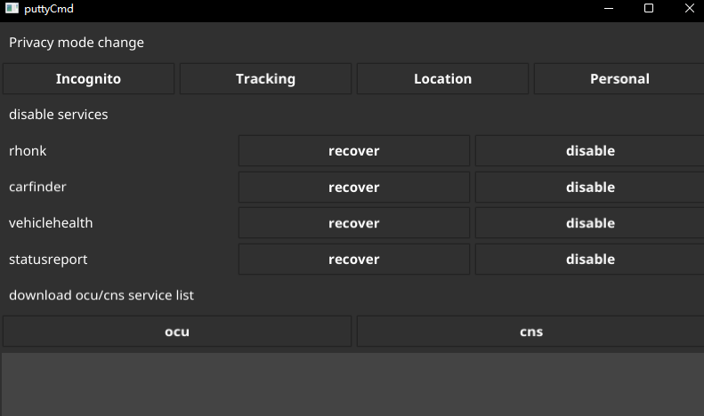

puttyCmd工具说明

```text
解决方案:
远程设备无法开放指定的端口(9773,29773),但是有ssh的22端口
绕过9773端口,使用22端口连接成功后使用curl命令进行执行，将执行结果返回

实现:
1.登录页面是ssh连接所需的输入项，输入错误或连接错误会提示;
2.输入正确的账号和密码后会自动将curl文件推送到/mnt/目录下,然后赋予可执行权限;
3.执行成功后进入到第2个页面为具体的操作页面;
```
登录页面    
     
操作页面    
     
